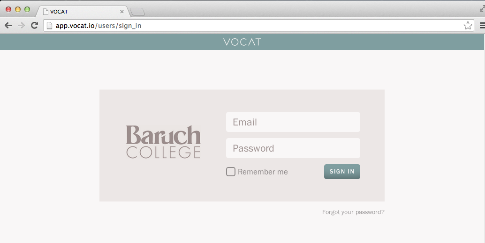
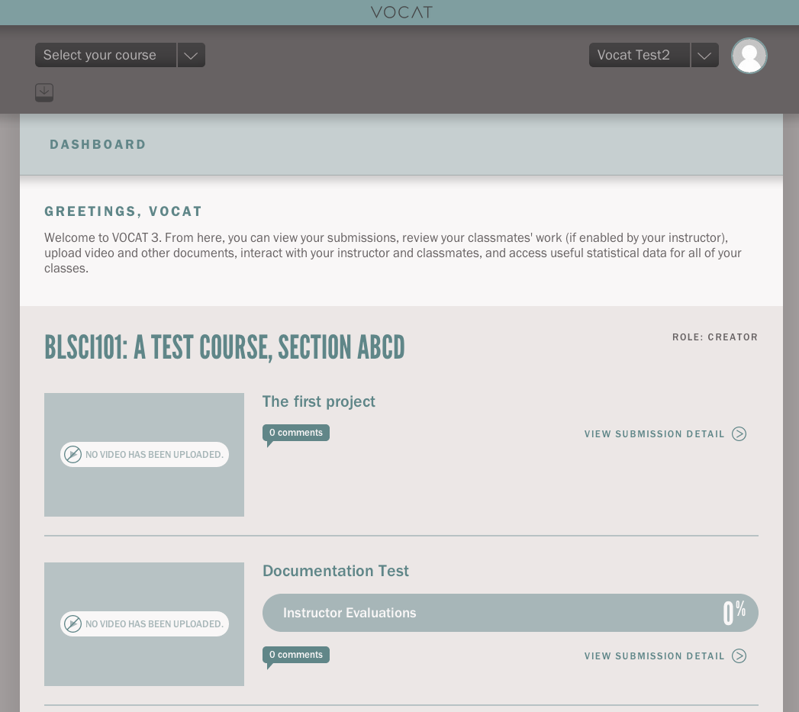
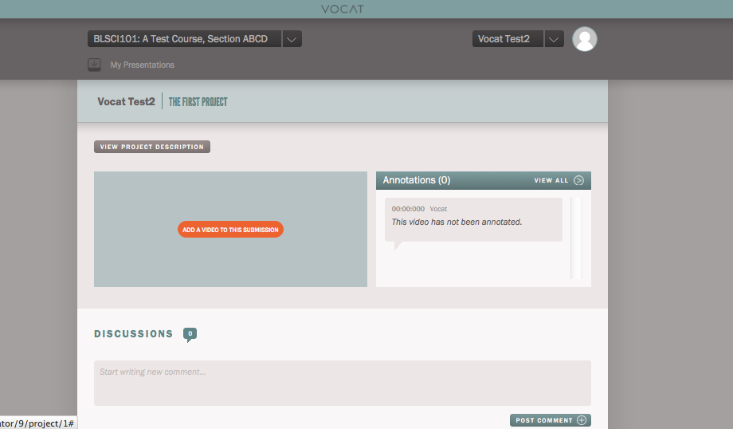

# CREATOR

The **CREATOR** user role is given to students in a class that is utilizing the VOCAT system. The following portion of the documentation seeks to make the facets of this user role as direct and clear as possible.

### First Steps/Login
---

 * Navigate in a browser to the URL app.vocat.io
 * Log in with Baruch email address and Active Directory password (same password used to log in to email, on-campus WiFi, and computer lab or classroom computers)

### Dashboard
---

 * Creator should see initial greeting and a selection of courses in which the user has been enrolled.
 * Creator should see screen name and (optional) avatar in top right-hand corner of screen.

This is the first page arrived at after logging in. It displays an overview of the creator’s courses, showing course titles, project submissions, and scores. It also provides thumbnail versions of the user’s most recently added videos.

### Creating New Video Submissions
---

 * Navigate to assignment selection
 * Click **VIEW SUBMISSION DETAIL (>)**
 * Click **ADD A VIDEO TO THIS SUBMISSION** button in video thumbnail container
 * Select an option: **UPLOAD A VIDEO, ADD A YOUTUBE VIDEO, or ADD A VIMEO VIDEO**

From the dashboard a creator can choose to specify a single class using the left-top corner dropdown, or the creator can choose to remain on the dashboard where all class assignments can be viewed. If the student has not yet created a video submission for an enrolled in class, there will appear on the dashboard a frame with a button that reads **NO VIDEO HAS BEEN UPLOADED**.
From here the creator should click on the hyperlink **VIEW SUBMISSION DETAIL** in the bottom-right of the relevant video/evaluation panel or on project title. The next page should look similar, but instead of the button in the center of the thumbnail frame should read **ADD A VIDEO TO THIS SUBMISSION**. By clicking on this button, a series of options appears, allowing the creator to choose a method by which to upload his or her video submission.

### YouTube and Vimeo
---

Please visit our video documntation for instructions on uploading files to Vimeo and YouTube:
[Video Documentation](#)

### Upload to VOCAT servers
---

If the creator chooses to upload a video directly to VOCAT, it should be kept in mind that the video format must be **AVI, FLV, MP4,** or **MPEG-2**. Maximum size of a video must be less than 1MB. After clicking **UPLOAD A VIDEO** button you will be given the option to **DRAG AND DROP OR CLICK TO SELECT A VIDEO FILE**. A user can simply drag a video file into this box, and the uploading process will begin, or the creator can click the button that these options are written on, which will bring up a local file selection interface. You will have to wait for a moment as your video is transcoded, but after this process your video should be ready to view.

The video thumbnail should go from looking like this:

To looking like this:

### Annotations
---

Both the creator and evaluator have the ability to annotate video submissions. The annotation tool automatically logs the time at which the annotation is composed. All the creator or evaluator has to do to annotate is during video playback, simply enter annotation text in the text box below video screen that reads ***Enter a video annotation…***

### Scores
---

The creator can examine scores given to them by their evaluator. a thermometer-style visualization reports the percentage out of 100. If the creator clicks on this visualization more rubric detail appears below, giving more clarity to the evaluator’s critique.

### Discussions
---

Creators can also engage in a discussion section that supplements each submitted video. A textbox appears under the DISCUSSIONS header. This allows for feedback and communication between creator-evaluator and/or creator-creator.

### Help Dropdown (Arrow Glyph)
---

 * **Activate Help Overlay**
 * Click **FAQ** to access frequently asked questions.
 * **VOCAT Tutorial** available
