# EVALUATOR

The **EVALUATOR** user role is given to the instructor of a class that is utilizing the VOCAT system. The following portion of the documentation seeks to make the facets of this user role as direct and clear as possible.

### First Steps/Login
---

 * Navigate in a browser to the URL **app.vocat.io**
 * Log in with Baruch email address and Active Directory password (same password used to log in to email, on-campus WiFi, and computer lab or classroom computers)

### Dashboard
---

 * Evaluator should see initial greeting and a selection of courses that have been presented to the VOCAT team.
 * Should see screenname and (optional) avatar in top right-hand corner of screen.

This is the first page arrived at after logging in. It displays an overview of the evaluator’s courses, showing course titles, statistics on submissions, scores, and student work. It also provides links to recently updated submissions and course projects.

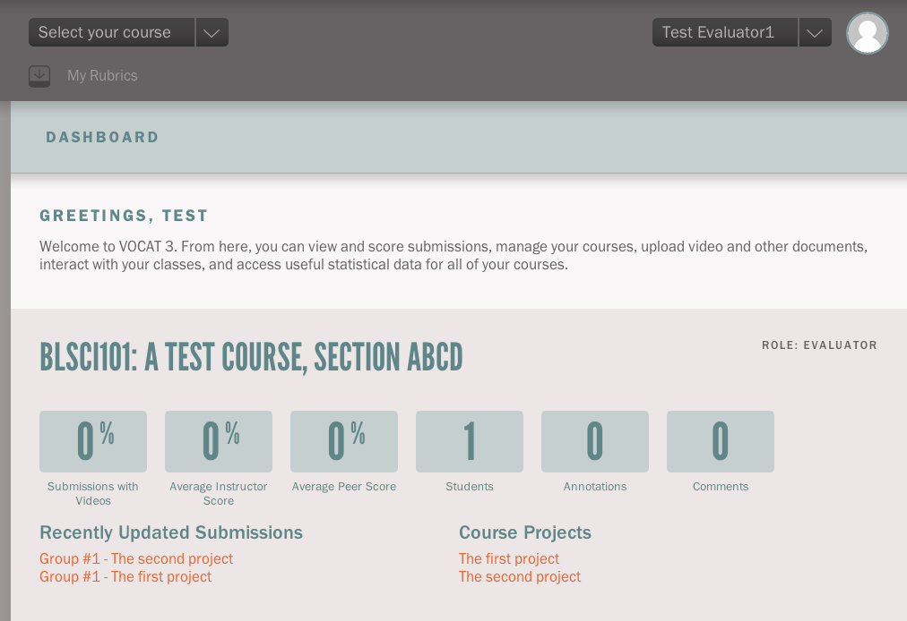

### Edit User
---

 * To log in as a different user, click the drop-down box in the top-right corner and click “log out.”
 * To edit your user profile, click your username in the drop-down menu.

### Help Dropdown (Arrow Glyph)
---

 * Activate Help Overlay
 * Click FAQ to access frequently asked questions.
 * VOCAT Tutorial available

### Course Selection Menu
---

The Course Selection Menu can be found in the upper left hand corner of the VOCAT dashboard. Here an evaluator can select a specific course that he or she wishes to examine/manipulate.

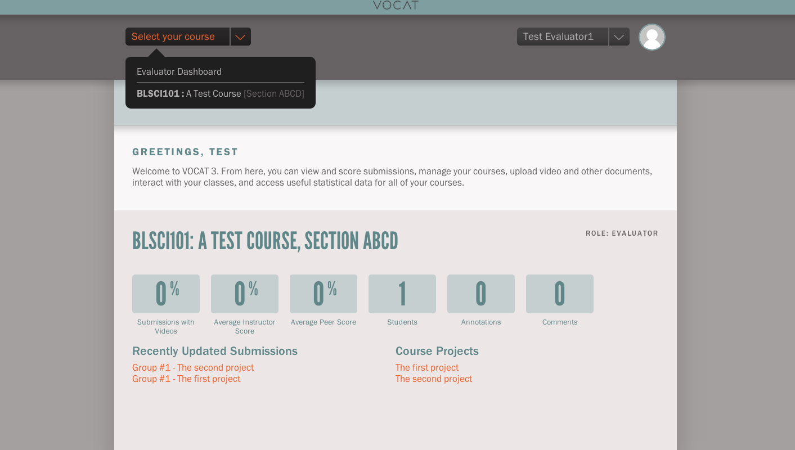

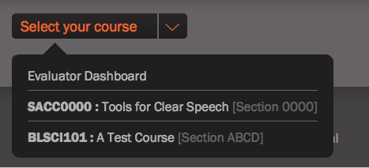

### Creating New Projects
---

 * Click **MANAGE COURSE > Projects**
 * Click **NEW PROJECT** button
 * Enter **NAME** and **DESCRIPTION** and assign **RUBRIC**

When a class is selected new options appear on the menu bar below the course selection drop-down. The next step in developing your class’ VOCAT instance is creating a new assignment or project. This can be accomplished by clicking the newly available **MANAGE COURSE** selection. From there the evaluator can click **Projects** from the dropdown:

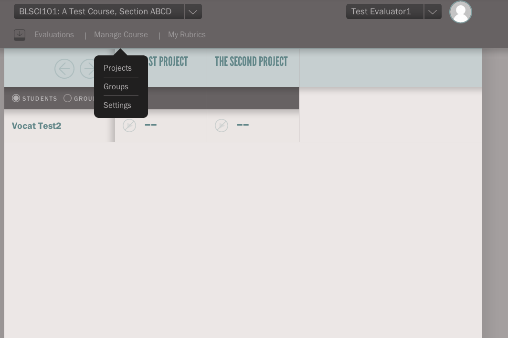

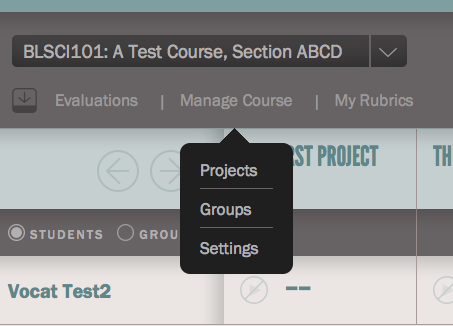

The next screen that appears should have a **NEW PROJECT** button in the top-right corner, that when clicked, creates a new project:

On the **NEW PROJECT** screen the evaluator is asked to give a name to the project and to describe the project. The evaluator also has the option to include an available rubric from a drop down menu in the lower left hand corner.

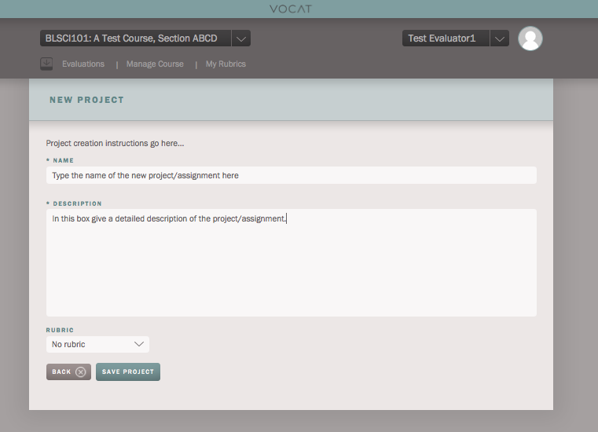

To save the changes click “Save project” button in the lower left corner.
To go back to the previous page click on the back button on the lower left.

### Editing Projects/Assignments
---

 * **Manage Course > Projects**
 * Click **Edit/Delete** on far right column
 * Click **SAVE PROJECT**

To edit or delete a project/assignment, return to the **MANAGE COURSE PROJECTS**
screen, and click on Edit/Delete in the far right column of the appropriate row. This
will take you to the **EDIT PROJECTS** screen, which looks almost identical to the
**NEW PROJECT** screen.

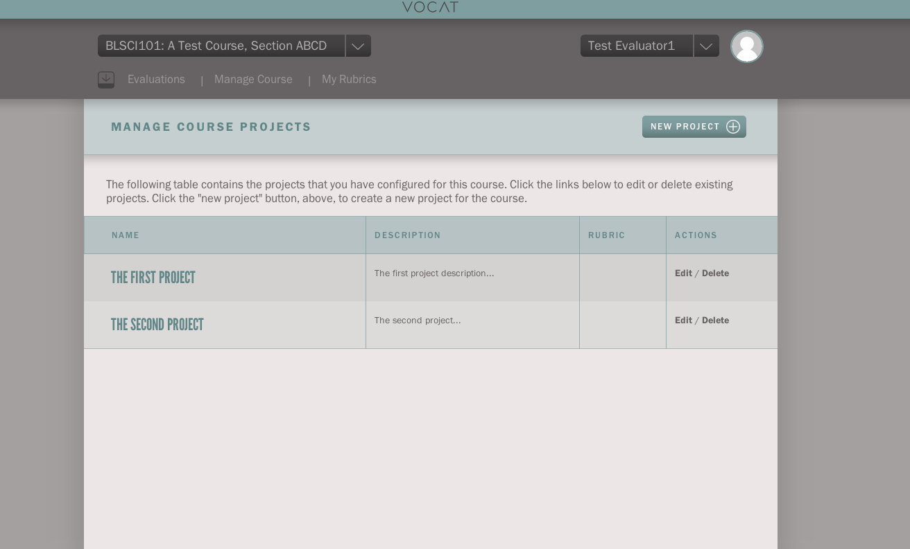

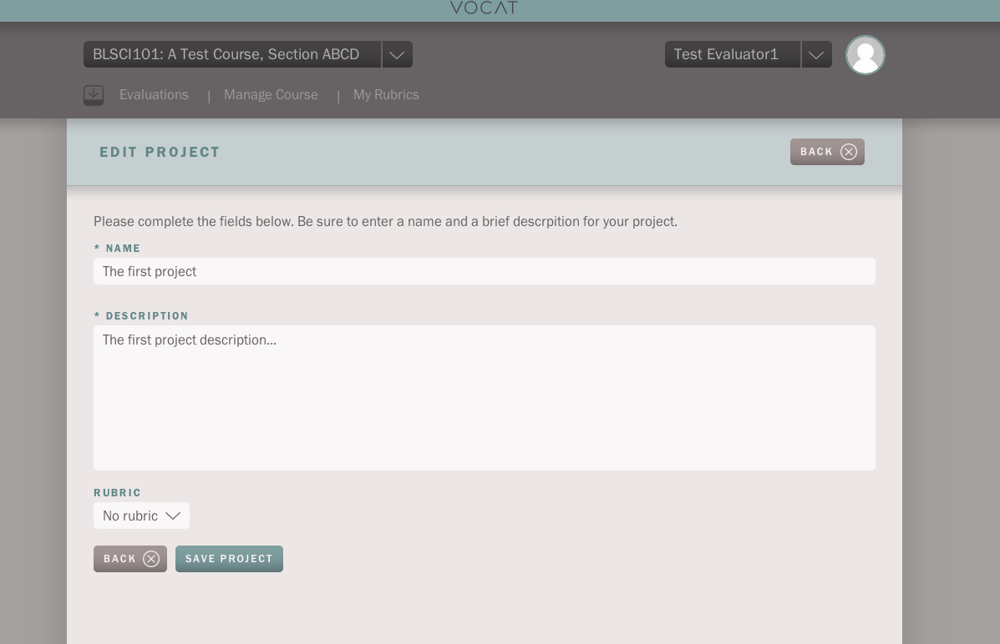

When the project/assignment is saved the evaluator will be taken to the **PROJECT DETAILS** screen. On this screen the evaluator has the opportunity examine key facets of the project, and edit them as needed. To go back to the previous page from this page, click the back button in the upper right corner.

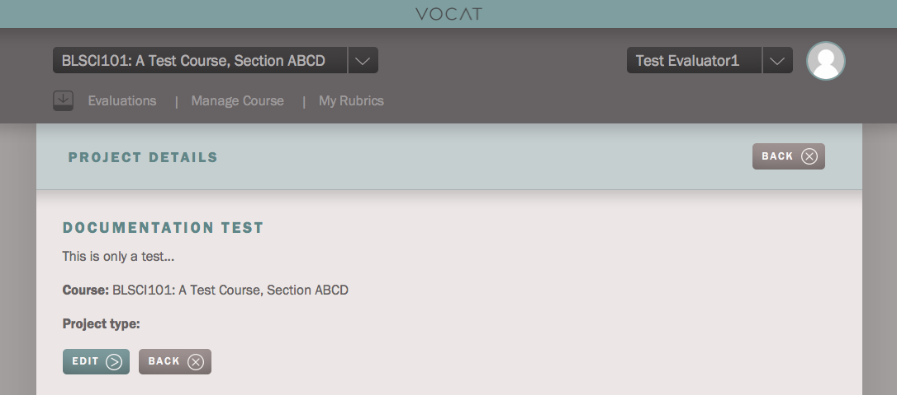

### Managing Groups
---

 * To create a group click on “Add a group” in the upper right corner.
 * Randomly assign members to a group click on “Auto Assign to Groups”

The next aspect the evaluator will want to access is the Groups page, found underneath the **Manage Course** dropdown. This will take the evaluator to the **MANAGE GROUPS** page where he or she will assign students to appropriate groups.

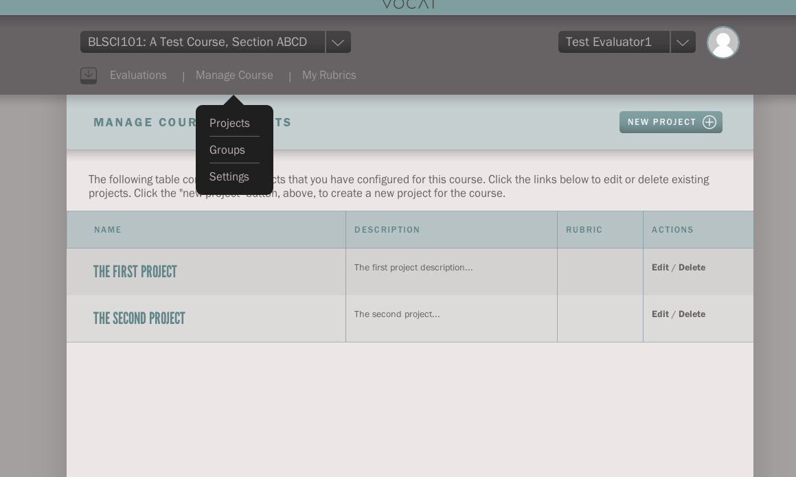

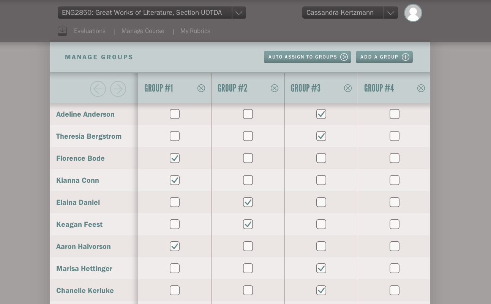

### Editing Course Settings
---

Found beneath the Manage Course menu in the top-left corner, the **EDIT COURSE SETTINGS** page allows the
evaluator to communicate a course message. This page also gives the evaluator access to **COURSE CONFIGURATION** at the lower half of the screen. This allows:

 - Enabling public discussion
 - Enabling peer review
 - Allowing creators to upload video
 - Allowing self-evaluation

After evaluator has customized these options appropriately, the **SAVE SETTINGS** button is located at the bottom-left corner of the page.

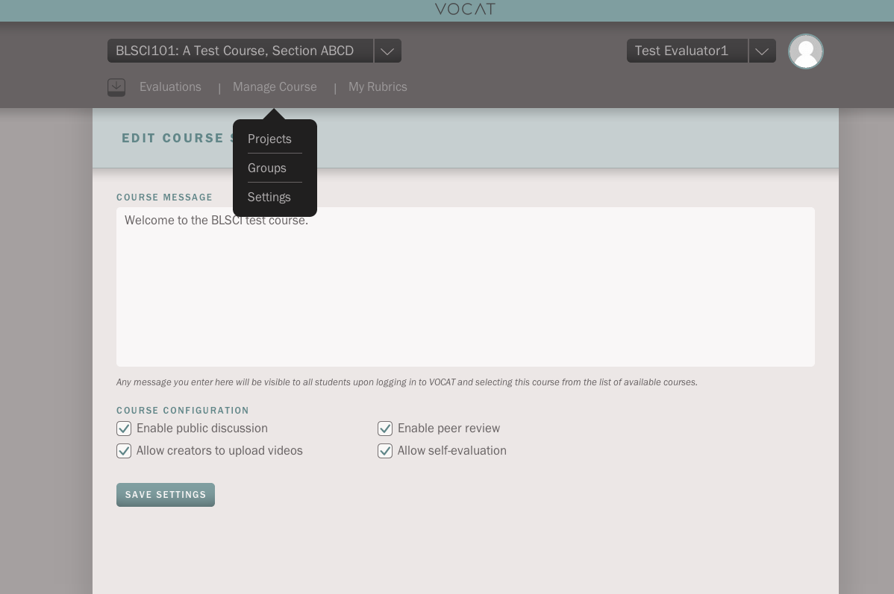

### Utilizing Rubrics
---

 * To create a new rubric or to use an already existing rubric click My Rubrics on the upper-left side of the page.
 * To create a rubric click on the green button **NEW RUBRIC** on the upper-right side.

From the Rubrics Management Page you can create new rubrics, view all rubrics on your VOCAT instance, or click into existing rubrics for editing. You can also choose to make them “public,” which will make them available to other Vocat evaluators for cloning and modification. To make a Vocat rubric public, click into the rubric, click “Modify,” and then select “Yes” from the “Is this a system-wide rubric?” dropdown menu.

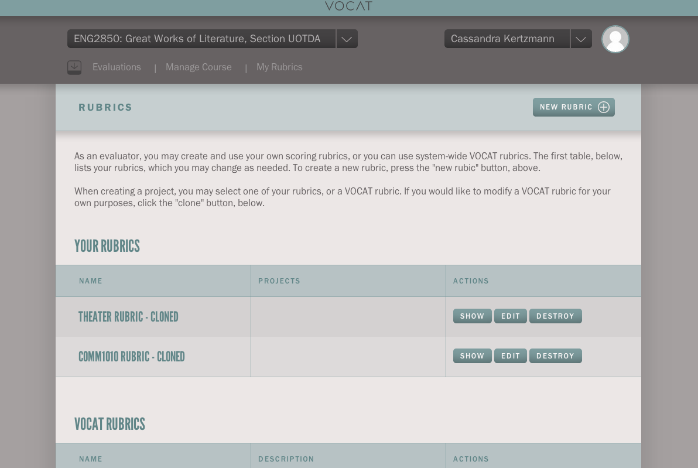

### Evaluation Overview
---

 * Click Evaluations
 * Top row shows Project titles
 * Far left column displays STUDENTS names or GROUPS based on selection.
 * Columns beneath row of Project titles display

Once projects have been created and videos uploaded and scores inputted, the course overview page can be accessed by clicking on Evaluations in the menu in the top-left corner. This page will show thumbnails representative of the content. See the screenshot below as an example.

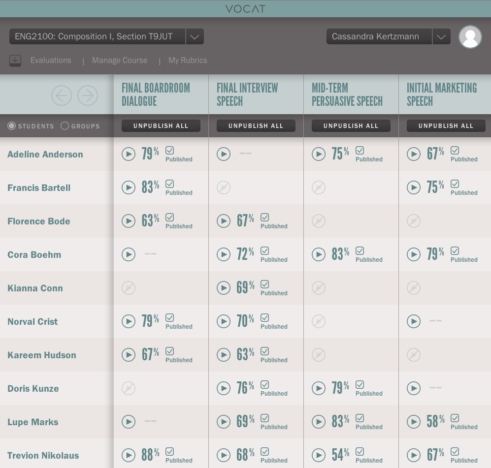

### My Rubrics (Create New Rubric)

---

 * To create a rubric or to use an already existing rubric click on My Rubrics on the upper-left side of the page.
 * To create a new rubric click on the green button titled NEW RUBRIC on the upper-right side.
 * To use an existing rubric, navigate to VOCAT RUBRICS, select CLONE option

To create a rubric click on the green tab “New Rubric” on the upper right side.

Enter the name and description of the rubric. Try to be as specific as you can, especially if this will be a public rubric, available to all Vocat users in the instance.

Enter the lowest possible and highest possible scores for scoring criteria for your rubric. The default is set at 0-100 but you can change it to whatever best suits your needs.

Add as many scoring criteria as you wish by clicking the **ADD CRITERIA** button at the bottom of the screen. The criteria are what you are evaluating; common criteria include “Eye Contact,” “Use of Visual Aids,” “Clarity of Speech,” etc. Once you’ve entered the criteria, you can navigate them with the two arrows on the bottom left of the screen.

For each critera, define the score ranges by clicking the **ADD RANGE** button. Give each range a name. Typical range names are “High,” “Medium,” “Low” or “Excellent,” “Very Good, “Good,” “Fair,” “Poor,” etc.

Begin with the lowest range (“Low”) and work your way up to the highest (“High”). As you add ranges, Vocat will calculate the score ranges based on the highest possible and lowest possible scores you defined earlier. You can adjust the scores for each range with the “Rubric Score Ranges” slider.

For each criteria you’ve defined, enter a detailed description by clicking on the range name under the criteria name (“Excellent Eye Contact,” “Good Eye Contact,” etc.) Try to be as specific and as thorough as possible. These descriptions should make it clear to all using the rubric how to differentiate, for example, between “Good Eye Contact,” “Fair Eye Contact,” and “Poor Eye Contact.”

When you are finished. Save your rubric by clicking on the SAVE RUBRIC button below the slider.

